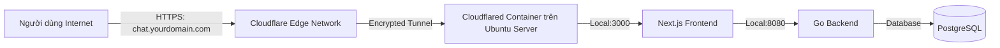

# Hướng Dẫn Triển Khai Toàn Diện & Public Ra Internet Cho AI Share Safe

Tài liệu này hướng dẫn chi tiết cách chạy thử nghiệm cục bộ, triển khai lên **máy tính cây cũ (Ubuntu Server)** và **public ra ngoài internet an toàn miễn phí 100% bằng Cloudflare Tunnel**.

---

## 1. Chạy Thử Nghiệm Trên Máy Cục Bộ (Local Dev)

### Bước 1: Khởi động Backend Go
Mở Terminal 1:
```bash
cd backend
go run cmd/server/main.go
```
*Backend sẽ lắng nghe tại `http://localhost:8080`.*

### Bước 2: Khởi động Frontend Next.js
Mở Terminal 2:
```bash
cd frontend
npm run dev
```
*Frontend sẽ mở tại `http://localhost:3000`.*

### Bước 3: Đăng nhập & Trải nghiệm
1. Mở trình duyệt vào `http://localhost:3000`.
2. Màn hình Passcode sẽ xuất hiện. Nhập passcode mặc định: **`gemini2026`** (hoặc passcode bạn đã cấu hình trong `.env`).
3. Trải nghiệm chat với mô hình **Gemini 3.7 Flash** gõ chữ thời gian thực siêu mượt!

---

## 2. Triển Khai Lên Máy Ubuntu Server (Bằng Docker Compose)

Khi bạn muốn đưa toàn bộ hệ thống lên máy tính cây cũ chạy Ubuntu Server để hoạt động 24/7:

### Bước 1: Copy mã nguồn lên Ubuntu Server
Bạn có thể dùng `git clone` hoặc `scp` để copy toàn bộ thư mục `ai-share-safe` vào máy Ubuntu:
```bash
cd ~/ai-share-safe
```

### Bước 2: Tạo file `.env` trên Ubuntu Server
```bash
cp .env.example .env
nano .env
```
Điền các giá trị chính:
```env
DB_USER=aisharesafe
DB_PASSWORD=YourSecurePassword2026!
DB_NAME=aisharesafe_db

# Điền 1 hoặc nhiều Gemini API Keys (xoay vòng tự động)
GEMINI_API_KEYS=YOUR_GEMINI_API_KEY_1,YOUR_GEMINI_API_KEY_2

DEFAULT_ACCESS_PASSCODE=gemini2026
DEFAULT_MODEL=gemini-3.7-flash
```

### Bước 3: Khởi chạy 1 lệnh duy nhất
```bash
docker compose up -d --build
```

Kiểm tra trạng thái các container:
```bash
docker compose ps
```
Bạn sẽ thấy cả 3 container:
- `aisharesafe_postgres` (Port 5432)
- `aisharesafe_backend` (Port 8080)
- `aisharesafe_frontend` (Port 3000)

Lúc này, từ bất kỳ máy tính/điện thoại nào trong mạng WiFi gia đình, bạn đều có thể truy cập `http://<IP_MÁY_UBUNTU>:3000` để chat!

---

## 3. Hướng Dẫn Public Ra Ngoài Internet Bằng Cloudflare Tunnel (Zero Trust)

Để người dùng bên ngoài internet (bạn bè, đối tác, bản thân khi ra ngoài) có thể truy cập web chat mà:
- ❌ **Không cần mở port Router (No Port Forwarding)** (an toàn tuyệt đối cho mạng gia đình).
- ❌ **Không cần thuê IP Tĩnh (No Static IP)** (nhà mạng đổi IP thoải mái).
- ✅ **Miễn phí 100% chứng chỉ bảo mật HTTPS (ổ khoá xanh)**.
- ✅ **Ẩn IP nhà riêng & có tường lửa chống DDoS của Cloudflare**.



### Các bước thực hiện:

#### Bước 3.1: Đăng ký Cloudflare và thêm Domain
1. Đăng ký tài khoản miễn phí tại [cloudflare.com](https://dash.cloudflare.com).
2. Thêm tên miền của bạn (có thể mua domain rẻ 1-2$ như `.xyz`, `.top` hoặc dùng domain có sẵn) và trỏ Nameservers về Cloudflare.

#### Bước 3.2: Tạo Cloudflare Tunnel
1. Trong bảng điều khiển Cloudflare, vào menu bên trái: **Zero Trust** -> **Networks** -> **Tunnels**.
2. Bấm **Add a tunnel** -> Chọn **Cloudflared** -> Đặt tên (ví dụ: `ai-share-safe-tunnel`).
3. Tại trang chọn môi trường cài đặt, ở mục **Docker**, bạn sẽ thấy một đoạn lệnh chứa mã token dài có dạng:
   `eyJhIjoiYTM1...`
4. Copy chuỗi token này (`CLOUDFLARE_TUNNEL_TOKEN`).

#### Bước 3.3: Cấu hình Hostname trên Cloudflare
1. Chuyển sang tab **Public Hostname** trên giao diện Tunnel của Cloudflare:
   - **Subdomain:** `chat` (hoặc để trống nếu dùng domain chính)
   - **Domain:** chọn tên miền của bạn (ví dụ: `yourdomain.com`)
   - **Type:** `HTTP`
   - **URL:** `frontend:3000` (hoặc `localhost:3000`)
2. Bấm **Save tunnel**.

#### Bước 3.4: Bật Cloudflared trong `docker-compose.yml`
Trên máy Ubuntu Server, mở file `.env` và thêm:
```env
CLOUDFLARE_TUNNEL_TOKEN=eyJhIjoi... (Dán token vừa copy vào)
```

Mở file `docker-compose.yml` và bỏ dấu `#` (uncomment) ở service `cloudflared`:
```yaml
  cloudflared:
    image: cloudflare/cloudflared:latest
    container_name: aisharesafe_tunnel
    restart: always
    command: tunnel --no-autoupdate run --token ${CLOUDFLARE_TUNNEL_TOKEN}
    depends_on:
      - frontend
      - backend
    networks:
      - aisharesafe_net
```

Chạy cập nhật:
```bash
docker compose up -d
```

🎉 **XONG!** Bây giờ bạn có thể mở điện thoại hoặc bất kỳ máy tính nào trên thế giới và truy cập:
👉 `https://chat.yourdomain.com`

---

## 4. Tóm Tắt Lệnh Quản Trị Hệ Thống Hữu Ích

- **Xem log thời gian thực:**
  ```bash
  docker compose logs -f
  ```
- **Khởi động lại toàn bộ:**
  ```bash
  docker compose restart
  ```
- **Cập nhật code mới và build lại:**
  ```bash
  git pull
  docker compose up -d --build
  ```
- **Kiểm tra mức độ ngốn RAM/CPU của máy cây:**
  ```bash
  docker stats
  ```
